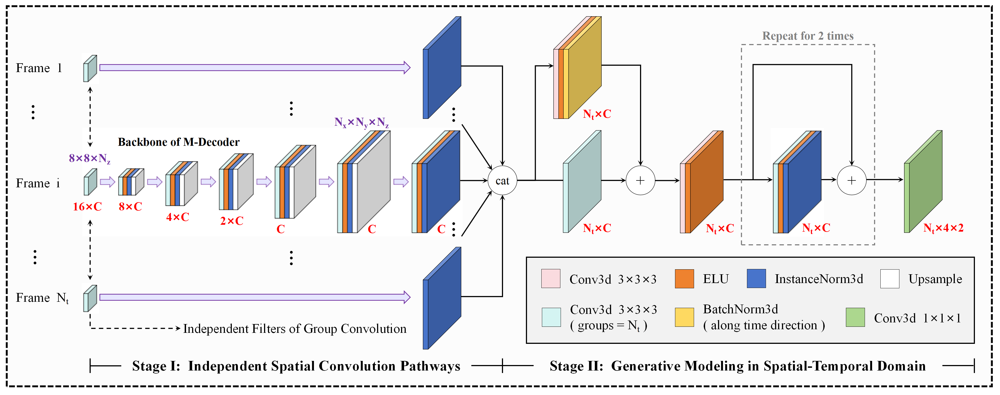
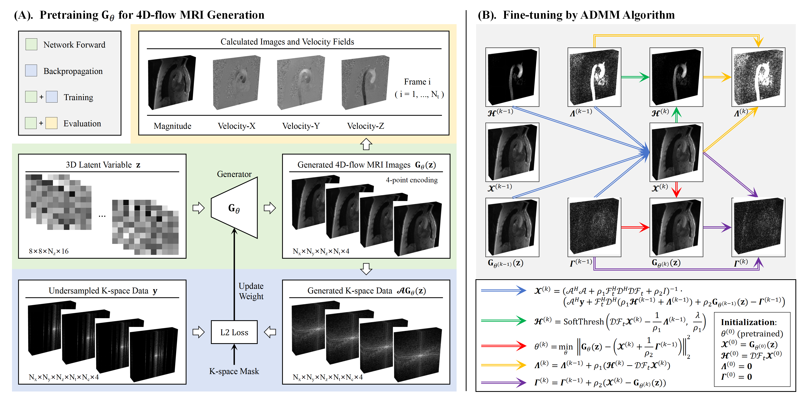

# Unsup_4DFlow_MRI
The implementation for the "Unsupervised 4D-flow MRI reconstruction based on partially-independent generative modeling and complex-difference sparsity constraint".

Generator network:

Optimization algorithm:

